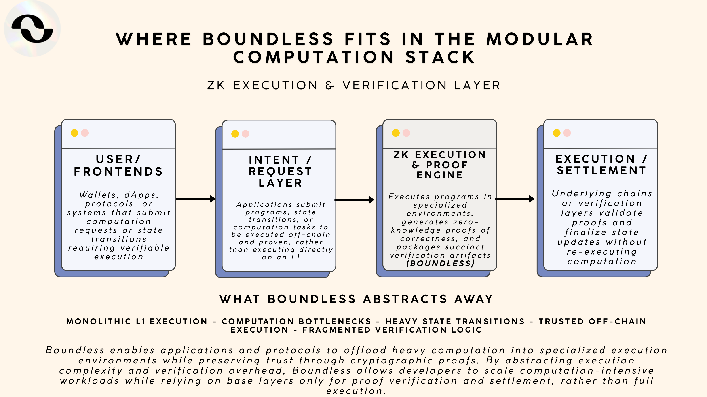

🪐 Boundless / ZKC

Boundless (also referred to as ZKC) is a modular execution and verification protocol designed to provide lightweight zk-based execution environments that deliver fast, provable computation with minimal trust assumptions. Instead of executing complex transactions directly on heavy L1s, Boundless enables developers to deploy custom execution environments that leverage zero-knowledge proofs to verify state transitions succinctly and securely.

At its core, Boundless combines programmable execution with cryptographic proof generation so that state transitions can be validated off-chain and then verified on a base chain with minimal data and high integrity. This architecture allows protocols to build scalable, composable systems where computation and verification are separated: execution happens in flexible environments, and correctness is guaranteed through succinct proofs posted and checked on settlement layers.

Boundless supports use cases such as application-specific execution environments, high-throughput transaction processing, zk-enabled state verification, and modular rollups or chains that require fast finality without sacrificing trust guarantees. Developers can tailor their execution rulesets while still delivering verifiable outcomes to users and other chains.

What ZKC (Boundless) abstracts away • Monolithic L1 execution bottlenecks • Heavy data availability requirements • Large state transition overhead on base layers • Trusted sequencer assumptions • Fragmented verification infrastructure

The result is a scalable execution and proof layer that lets applications outsource heavy computation to specialized environments while retaining security through cryptographic verification, enabling high-performance workloads with strong trust guarantees across modular blockchain ecosystems.
