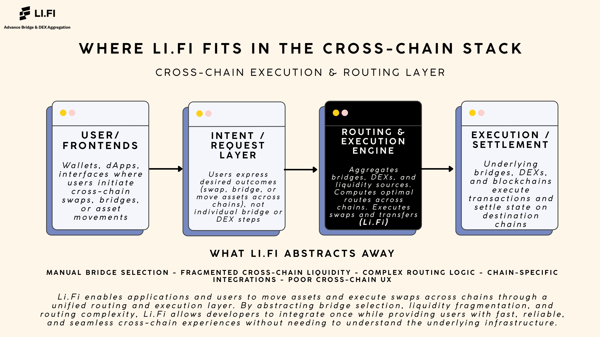

🧭 Li.Fi

Li.Fi is a cross-chain liquidity and routing protocol that enables applications and users to move assets and execute swaps seamlessly across blockchains. Instead of requiring manual bridge selection or individual integrations with DEXs and bridges, Li.Fi aggregates liquidity sources and routing logic into a single abstraction layer that determines the best execution path automatically.

At its core, Li.Fi acts as a cross-chain execution engine that combines bridges, DEX aggregators, and on-chain messaging to handle asset movement and swaps across chains. It focuses on execution and routing efficiency rather than settlement or security, relying on underlying bridges, DEXs, and blockchains to perform final settlement while Li.Fi optimizes how transactions get there.

Li.Fi supports use cases such as cross-chain swaps, onboarding flows, multi-chain DeFi applications, wallet integrations, and automated asset rebalancing, enabling developers to offer seamless multi-chain experiences without exposing users to underlying complexity.

What Li.Fi abstracts away • Manual bridge selection • Fragmented cross-chain liquidity • Complex routing across DEXs and bridges • Chain-specific integration logic • User-facing cross-chain UX friction

The result is a unified execution and routing layer that allows applications to offer fast, reliable, and user-friendly cross-chain interactions while developers integrate once and inherit broad multi-chain coverage without rebuilding infrastructure for each network.
