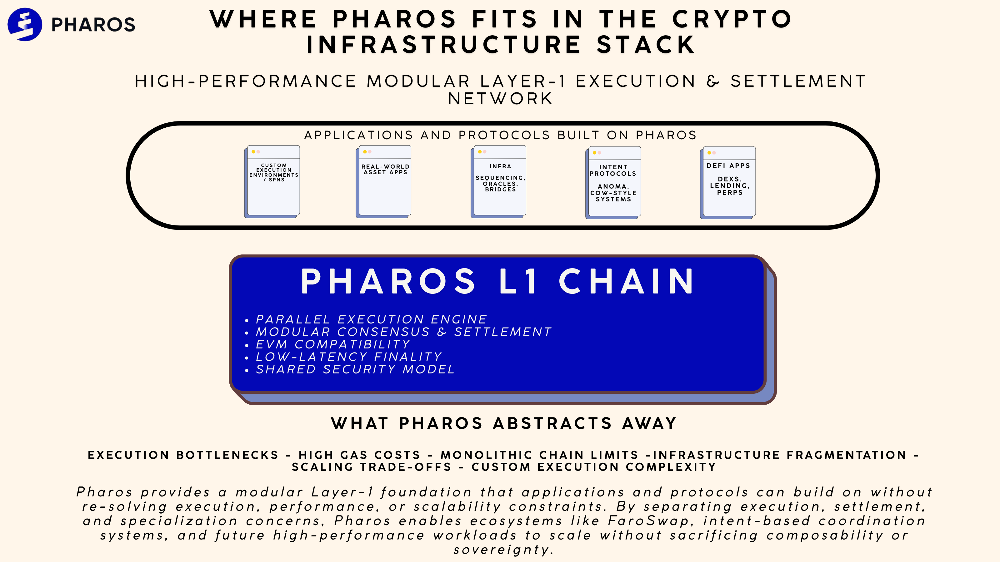

🧱 Pharos Network

Pharos Network is a high-performance, modular Layer-1 blockchain built to support scalable decentralized applications, real-world asset tokenization, and internet-scale finance. It combines deep-parallel execution, EVM compatibility, and a full-stack modular architecture to deliver high throughput, sub-second finality, and flexible execution environments for developers and users alike.

At its core, Pharos uses a parallel processing architecture that separates network, consensus, execution, settlement, and data availability layers, enabling performance metrics far beyond traditional monolithic blockchains. This design allows Pharos to achieve tens of thousands of transactions per second with low latency, while maintaining robust security, decentralization, and composability with existing Ethereum tooling. 

Pharos also supports Special Processing Networks (SPNs), customizable execution environments that extend the base chain’s capabilities for domain-specific workloads such as high-frequency finance, real-world asset applications, and privacy-preserving compute, all while leveraging shared network security. 

What Pharos abstracts away − Traditional blockchain throughput limits − Monolithic execution bottlenecks − Single-purpose chain constraints − Barriers to institutional and real-world asset use cases

The result is a base Layer-1 blockchain that enables developers to build fast, secure, and scalable DeFi, RWA, and application-specific networks, while giving users high-performance transactions, low fees, and broad compatibility across the broader Web3 ecosystem. 
