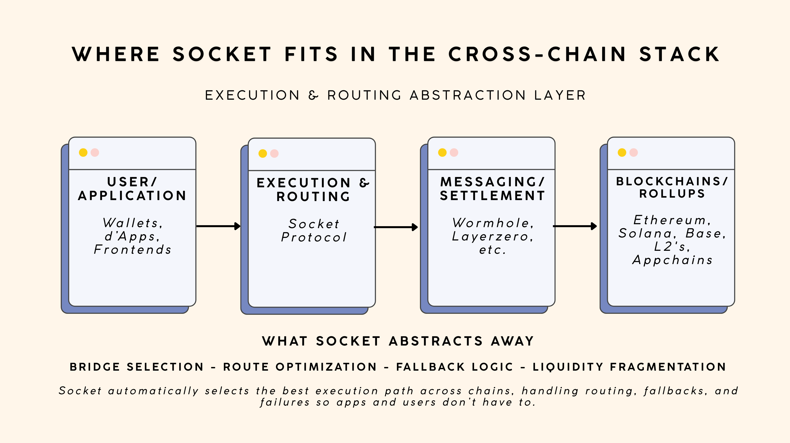

# Socket Protocol

Socket is an execution and routing abstraction layer that sits between applications
and lower-level cross-chain messaging or settlement infrastructure.

Instead of requiring apps to integrate individual bridges or routes,
Socket automatically selects the optimal execution path across chains and
handles fallbacks and failures internally.

### What Socket abstracts away
- Bridge selection
- Route optimization
- Fallback logic
- Liquidity fragmentation

The result is simpler integrations for developers and more reliable cross-chain
experiences for users.
